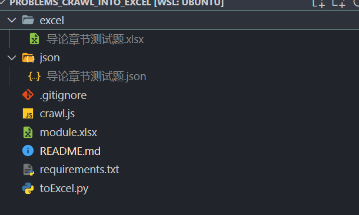

# 学习通单元测验爬虫油猴脚本

为了方便使用整成了油猴脚本

但是json to excel我不会写油猴的导入库，还是python糊一下吧

使用方法：

脚本使用方法：


下载或者Clone 源代码

```bash
git clone https://github.com/sd0ric4/problems_crawl_into_excel.git
cd problems_crawl_into_excel
pip install -r requirements.txt
# 把json文件放到新建的json文件夹内
python toExcel.py
```


